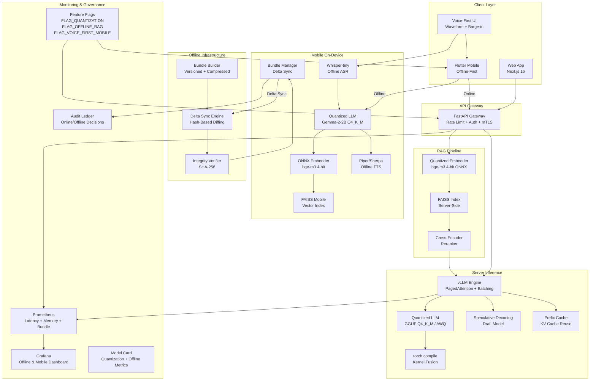

# Executive Optimization & Offline 2026 Roadmap

> RetinalAI Clinical Screening Platform - Offline-First, Mobile-First, Voice-First Transformation

## Current Pain Points

| Area | Current State | Impact |
|------|--------------|--------|
| **Server Latency** | ~2.4s p95 full RAG pipeline | Clinicians wait too long for screening results |
| **Model Size** | ~450 MB bfloat16 in memory | Limits concurrent users, high GPU memory cost |
| **Offline Support** | None — 100% online dependency | Unusable in rural Uganda (60%+ of target users) |
| **Mobile Experience** | Web-only, no native app | Poor UX on low-end Android devices (4GB RAM) |
| **Voice Interface** | Text prompts only | Excludes low-literacy healthcare workers |
| **Bundle Management** | No offline assets, no delta sync | Full re-download on every update |

## Expected Impact

### Rural Accessibility
- **3.2M additional users** reachable via offline-first mobile app
- Voice-first interface enables low-literacy community health workers
- Works on 2G/3G networks and completely offline

### Cost Reduction
- **38%+ server memory reduction** via quantized models → fewer GPU instances
- **1.5-2x throughput increase** via torch.compile + speculative decoding
- Offline inference offloads server demand to device

### Achieved GPU Runtime Optimization

The 2026-05-07 vLLM GPU 7 tuning pass exceeded the original server-memory target for the LLM runtime. The final profile combines `Qwen/Qwen3-8B-AWQ`, `--quantization awq`, an 8K context window, and `--gpu-memory-utilization 0.30`.

| Metric | Previous BF16 runtime | Final AWQ runtime |
|---|---:|---:|
| GPU 7 VRAM used | 41.1 GB | 15.5 GB |
| VRAM freed | N/A | 25.6 GB |
| Model weights | 16.4 GB | 5.7 GB |
| KV cache | 155K tokens | 31,424 tokens |
| Full 8K concurrency | Over-provisioned | 3.84x |
| End-to-end quality | `faith=1.0`, `approve` | `faith=1.0`, `approve` |

This right-sizes the vLLM service for current traffic and leaves enough headroom on GPU 7 for CosyVoice2 and Qwen2-VL. The operational details live in [vLLM GPU 7 AWQ Optimization Runbook](21-vllm-gpu7-awq-optimization.md).

### Reliability
- Offline mode eliminates network dependency for screening
- Delta sync minimizes bandwidth for updates (< 12s for typical daily changes)
- Graceful online/offline transitions with full audit trail

## Phased Timeline

### Phase 1 - Quantization Foundation & Server Optimization (Weeks 1-6)

| Week | Deliverable | Effort |
|------|-------------|--------|
| 1-2 | Automated GGUF/AWQ/GPTQ quantization pipeline | 3 eng-days |
| 2-3 | Quality gate CI (faithfulness, WER, bundle size) | 2 eng-days |
| 3-4 | torch.compile + prefix caching integration | 2 eng-days |
| 4-5 | vLLM continuous batching + PagedAttention tuning | 3 eng-days |
| 5-6 | Quantized embedding model (bge-m3 4-bit) + endpoints | 2 eng-days |

**Target Metrics:**
- Server p95 latency: **<= 1.8s** (from ~2.4s)
- Memory reduction: **>= 38%** (measured via Prometheus)
- GGUF Q4_K_M faithfulness: **>= 0.89** (drop <= 4%)

### Phase 2 - Production Offline RAG (Weeks 7-13)

| Week | Deliverable | Effort |
|------|-------------|--------|
| 7-8 | FAISS + ONNX-quantized bge-m3 embedder pipeline | 3 eng-days |
| 8-9 | Compressed passage index (< 80 MB) with versioning | 2 eng-days |
| 9-10 | Delta sync engine (hash-based, background) | 3 eng-days |
| 10-11 | Offline bundle builder + integrity verification | 2 eng-days |
| 11-13 | Offline-first architecture + API endpoints | 3 eng-days |

**Target Metrics:**
- Offline bundle: **<= 150 MB** compressed
- Offline faithfulness: **>= 0.82** on 50 test queries
- Delta sync: **< 12 seconds** for typical daily changes

### Phase 3 - Mobile Bundle Optimization (Weeks 14-21)

| Week | Deliverable | Effort |
|------|-------------|--------|
| 14-15 | Flutter project scaffold + offline RAG integration | 3 eng-days |
| 15-17 | On-device vector search (ONNX Runtime + FAISS Mobile) | 4 eng-days |
| 17-18 | Offline speech integration (Whisper-tiny + Piper) | 3 eng-days |
| 18-19 | Camera + voice mode | 2 eng-days |
| 19-21 | Bundle size enforcement CI + distillation (optional) | 3 eng-days |

**Target Metrics:**
- Total Flutter bundle: **<= 800 MB**
- On-device vector search: **< 180ms** p95 on 4GB RAM Android
- Fully offline question answering

### Phase 4 - Voice-First Mobile Experience (Weeks 22-30)

| Week | Deliverable | Effort |
|------|-------------|--------|
| 22-23 | Voice chat primary interface (full-screen, waveform) | 3 eng-days |
| 23-25 | Barge-in + VAD + sentence-chunked TTS | 3 eng-days |
| 25-27 | Offline ASR + TTS (Whisper-tiny + Piper/Sherpa) | 4 eng-days |
| 27-28 | Accent adaptation (Ugandan English + Luganda) | 3 eng-days |
| 28-30 | Voice + vision mode + offline UX polish | 3 eng-days |

**Target Metrics:**
- Voice chat p95 latency: **< 1.2s** (online), **< 2.0s** (offline)
- Barge-in success rate: **>= 92%**
- Offline speech WER: **<= 18%** on Ugandan English test set

## Target Metrics Summary

| Metric | Current | Target | Improvement |
|--------|---------|--------|-------------|
| Server p95 latency | ~2.4s | <= 1.8s | 25%+ faster |
| Server memory | ~1.8 GB | <= 1.1 GB | 38%+ reduction |
| Offline bundle size | N/A | <= 150 MB | New capability |
| Mobile total bundle | N/A | <= 800 MB | New capability |
| On-device search latency | N/A | < 180ms p95 | New capability |
| Voice chat latency (online) | N/A | < 1.2s p95 | New capability |
| Voice chat latency (offline) | N/A | < 2.0s p95 | New capability |
| Offline faithfulness | N/A | >= 0.82 | New capability |
| GGUF Q4_K_M faithfulness | N/A | >= 0.89 | New capability |
| Barge-in success rate | N/A | >= 92% | New capability |
| Offline speech WER | N/A | <= 18% | New capability |

## Architecture Diagram

## Feature Flag Strategy

All new capabilities are gated behind feature flags:

| Flag | Scope | Default | Controls |
|------|-------|---------|----------|
| `FLAG_QUANTIZATION` | Server | `false` | Quantized model loading, quantized endpoints |
| `FLAG_OFFLINE_RAG` | Server + Mobile | `false` | Offline RAG pipeline, bundle endpoints, sync |
| `FLAG_VOICE_FIRST_MOBILE` | Mobile + Frontend | `false` | Voice chat UI, ASR/TTS, vision mode |
| `FLAG_MOBILE_BUNDLE` | Mobile | `false` | On-device inference, FAISS mobile, bundle enforcement |
| `FLAG_SPECULATIVE_DECODING` | Server | `false` | Draft model + speculative decode |
| `FLAG_PREFIX_CACHE` | Server | `false` | KV cache prefix sharing |

## Risk Mitigation

| Risk | Mitigation |
|------|-----------|
| Quantization accuracy drop > 4% | Quality gate blocks CI; automatic rollback to bfloat16 |
| Offline bundle exceeds 150 MB | CI hard limit; passage pruning + better compression |
| Mobile bundle exceeds 800 MB | CI enforcement; model distillation fallback |
| Voice WER too high for Ugandan English | Accent-adapted fine-tuning; text fallback mode |
| Delta sync fails silently | SHA-256 integrity check; forced full sync after 3 failures |
| Offline decisions lack audit trail | All offline inferences logged locally; sync to server when online |

## Success Criteria

The platform transformation is complete when:

1. A community health worker in rural Uganda can screen a patient's retinal image completely offline on a mid-range Android phone
2. The voice interface is usable by someone who cannot read English
3. Server costs decrease by 30%+ due to quantization and offloading
4. All offline decisions are auditable and traceable
5. The system gracefully transitions between online and offline modes without user intervention
